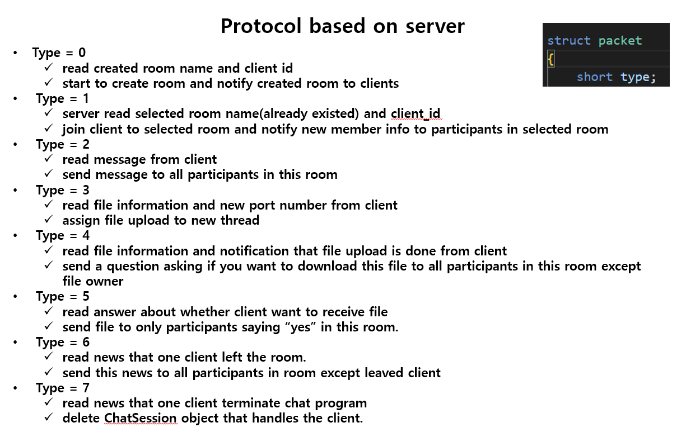
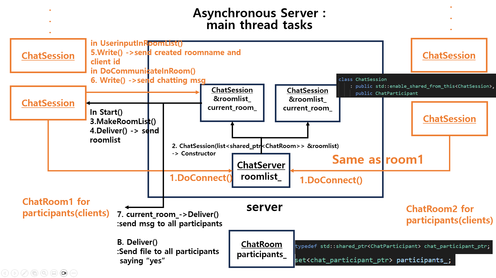
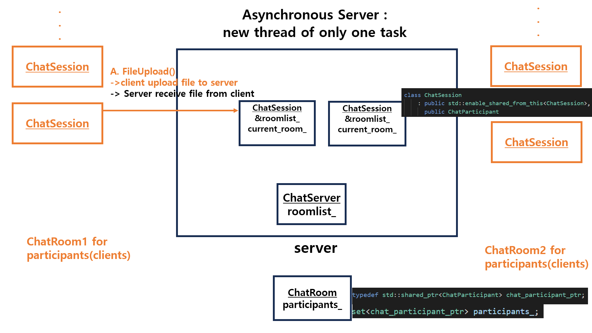
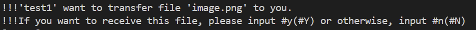

# Chat_Program_Project

## Project Introduction

- This program is an chat program made with Boost Library based on cpp. 

- [Boost.Asio Overview](https://www.boost.org/doc/libs/1_81_0/doc/html/boost_asio/overview.html)

- A terminal program was produced 

- Ubuntu(Linux) environment is required. 

- Installation required : `g++`, `cmake`

```
kho@kho-desktop:~/cpp$ cmake -version
cmake version 3.28.1

CMake suite maintained and supported by Kitware (kitware.com/cmake).
```
## Program Architecture







## Program Features

- When a client connects to the server, the server displays a list of currently running chat rooms to the client.

- Client can enter and leave the chat room he or she want. At this time, the status of entering or exiting the chat room is displayed to other clients participating in the chat room.

- In addition, newly entered clients can receive information about which clients are joining the room. 

- A client can create a new chat room, and when a new room is created, a new room list is delivered to clients who have not yet entered the room

- Clients in a room can send files they own to clients participating in the same room.

- When a file is uploaded to the server, the server asks the clients participating in the chat room whether they want to receive the file, and sends the file only to those who want to receive it.



- Clients can send and receive conversations while files are being transferred.

- The server run based on Boost.Asio as a whole without creating new thread and creating new socket.

- Only when uploading a file to the server, the task of transmitting the file to the server on a new socket is assigned to a new thread.

- See the guideline for detailed explanations with screenshots.

- reference C++11 chat Examples

- [C++11 chat Examples](https://www.boost.org/doc/libs/1_78_0/doc/html/boost_asio/examples/cpp11_examples.html)


## Build and Run the project

- use cmake to build project

- If boost library installed with FetchContent does not work well, You will need to install the boost library yourself system-wide.

- [boost_1_81_0.tar.gz download](https://boostorg.jfrog.io/artifactory/main/release/1.81.0/source/boost_1_81_0.tar.gz)


```
mkdir build && cd build 
cmake .. 
nproc # check the number of core on your computer

# build (modify the core number '4' after option -j accordingly)
make -j4
cd bin
```

```
./chat_client <host> <port> <ID>
```

```
./chat_server <port>
```